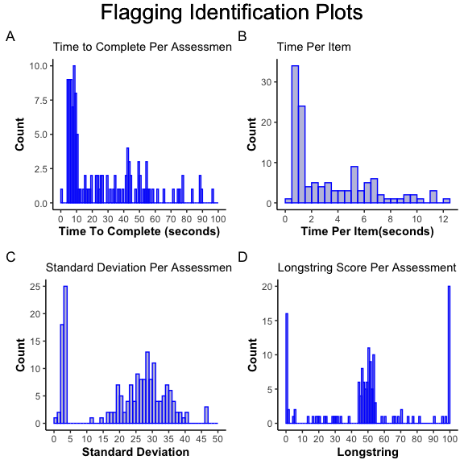

EMAeval Description
================
Noah Kraus
11/03/2020

# EMAeval R Markdown

The R package EMAeval contains functions created to help researchers
identify careless responses as well as responders ine EMA data. An
example dataset is included in the package to help the user better
understand the uses of each function. This dataset “EMAeval\_Data” is
used in the example code below.

There are 4 “participants,” each having 50 assessments. Each was asked 8
questions per assessment.

<table class="table" style="margin-left: auto; margin-right: auto;">

<caption>

EMAeval\_Data Example

</caption>

<thead>

<tr>

<th style="text-align:left;">

</th>

<th style="text-align:right;">

ID

</th>

<th style="text-align:left;">

StartDate

</th>

<th style="text-align:left;">

EndDate

</th>

<th style="text-align:right;">

Q1

</th>

<th style="text-align:right;">

Q2

</th>

<th style="text-align:right;">

Q3

</th>

<th style="text-align:right;">

Q4

</th>

<th style="text-align:right;">

Q5

</th>

<th style="text-align:right;">

Q6

</th>

<th style="text-align:right;">

Q7

</th>

<th style="text-align:right;">

Q8

</th>

</tr>

</thead>

<tbody>

<tr>

<td style="text-align:left;">

1

</td>

<td style="text-align:right;">

1001

</td>

<td style="text-align:left;">

2020-01-02 10:01:23

</td>

<td style="text-align:left;">

2020-01-02 10:02:07

</td>

<td style="text-align:right;">

61

</td>

<td style="text-align:right;">

9

</td>

<td style="text-align:right;">

46

</td>

<td style="text-align:right;">

39

</td>

<td style="text-align:right;">

5

</td>

<td style="text-align:right;">

64

</td>

<td style="text-align:right;">

74

</td>

<td style="text-align:right;">

32

</td>

</tr>

<tr>

<td style="text-align:left;">

56

</td>

<td style="text-align:right;">

1002

</td>

<td style="text-align:left;">

2020-01-07 10:01:16

</td>

<td style="text-align:left;">

2020-01-07 10:01:24

</td>

<td style="text-align:right;">

45

</td>

<td style="text-align:right;">

50

</td>

<td style="text-align:right;">

49

</td>

<td style="text-align:right;">

48

</td>

<td style="text-align:right;">

54

</td>

<td style="text-align:right;">

55

</td>

<td style="text-align:right;">

48

</td>

<td style="text-align:right;">

52

</td>

</tr>

<tr>

<td style="text-align:left;">

111

</td>

<td style="text-align:right;">

1003

</td>

<td style="text-align:left;">

2020-01-12 10:00:46

</td>

<td style="text-align:left;">

2020-01-12 10:12:08

</td>

<td style="text-align:right;">

72

</td>

<td style="text-align:right;">

99

</td>

<td style="text-align:right;">

25

</td>

<td style="text-align:right;">

68

</td>

<td style="text-align:right;">

23

</td>

<td style="text-align:right;">

42

</td>

<td style="text-align:right;">

21

</td>

<td style="text-align:right;">

25

</td>

</tr>

<tr>

<td style="text-align:left;">

172

</td>

<td style="text-align:right;">

1004

</td>

<td style="text-align:left;">

2020-01-23 09:58:22

</td>

<td style="text-align:left;">

2020-01-23 09:58:38

</td>

<td style="text-align:right;">

15

</td>

<td style="text-align:right;">

5

</td>

<td style="text-align:right;">

12

</td>

<td style="text-align:right;">

30

</td>

<td style="text-align:right;">

73

</td>

<td style="text-align:right;">

83

</td>

<td style="text-align:right;">

36

</td>

<td style="text-align:right;">

6

</td>

</tr>

</tbody>

</table>

# Functions

Below are the functions in the R package EMAeval. The functions are:

  - flagging\_df
  - flagging\_plots
  - TPI\_cutoff
  - SD\_cutoff
  - Perc\_Mode\_cutoff
  - Combined\_cutoff
  - Combined\_cutoff\_percent

Each section will be dedicated to a particular function, giving an
example of the usage with the EMAeval\_Data and showing the output.

## flagging\_df

*This function creates a dataframe that reports Time to Complete (TTC),
Time per Item (TPI), Item Standard Deviation (SD), and Longstring. If
the Longstring returns NA, then there was no longstring response because
all item responses were different. The partial results of the
flagging\_df function are based from the EMAeval\_Data Example above. *

``` r
flaggingDF <- flagging_df(EMAeval_Data, ttc.colnames = c("StartDate", "EndDate"), item.colnames = colnames(EMAeval_Data[,4:11]))
```

<table class="table" style="margin-left: auto; margin-right: auto;">

<caption>

Flagging Dataframe Example

</caption>

<thead>

<tr>

<th style="text-align:left;">

</th>

<th style="text-align:right;">

TTC

</th>

<th style="text-align:right;">

TPI

</th>

<th style="text-align:right;">

SD

</th>

<th style="text-align:left;">

Longstring

</th>

</tr>

</thead>

<tbody>

<tr>

<td style="text-align:left;">

1

</td>

<td style="text-align:right;">

44

</td>

<td style="text-align:right;">

5.50

</td>

<td style="text-align:right;">

25.21

</td>

<td style="text-align:left;">

NA

</td>

</tr>

<tr>

<td style="text-align:left;">

56

</td>

<td style="text-align:right;">

8

</td>

<td style="text-align:right;">

1.00

</td>

<td style="text-align:right;">

3.36

</td>

<td style="text-align:left;">

48

</td>

</tr>

<tr>

<td style="text-align:left;">

111

</td>

<td style="text-align:right;">

682

</td>

<td style="text-align:right;">

85.25

</td>

<td style="text-align:right;">

29.31

</td>

<td style="text-align:left;">

25

</td>

</tr>

<tr>

<td style="text-align:left;">

172

</td>

<td style="text-align:right;">

16

</td>

<td style="text-align:right;">

2.00

</td>

<td style="text-align:right;">

30.22

</td>

<td style="text-align:left;">

NA

</td>

</tr>

</tbody>

</table>

## flagging\_plots

*This function creates a histograms of each of the calculations reported
in the flagging\_df function. This can be used to help users identify
the cutoff values for TPI and SD.*

``` r
flagging_plots(EMAeval_Data, ttc.colnames = c("StartDate", "EndDate"), item.colnames = colnames(EMAeval_Data[,4:11]), number.items = 8)
```



*Note: the Longstring histogram has a much smaller scale for the Count.
This is due to the lack of longstring values because many assessments do
not have a Longstring value because all item responses differ.*

## TPI\_cutoff

*This function creates a dataframe of ID and data indices in which the
assessment met the cutoff criterion for Time per Item. The user inputs
their own cutoff for TPI. The user can also specify what type of
comparison they would like to complete with the cutoff value using
**condition =…** If responses to all items are mandatory, then the
following response should be included:*

    mandatory.response = TRUE

*Below is the code for the function.*

``` r
TPI_cutoff(EMAeval_Data, cutoff = 1, condition = "<=",  ttc.colnames = c("StartDate", "EndDate"),  number.items = 8, mandatory.response = TRUE, item.colnames = colnames(EMAeval_Data[,4:11]), ID.colname = "ID")
```

<div style="border: 1px solid #ddd; padding: 0px; overflow-y: scroll; height:400px; overflow-x: scroll; width:100%; ">

<table class="table" style="margin-left: auto; margin-right: auto;">

<caption>

Assessments Flagged by TPI Cutoff

</caption>

<thead>

<tr>

<th style="text-align:right;position: sticky; top:0; background-color: #FFFFFF;">

ID

</th>

<th style="text-align:right;position: sticky; top:0; background-color: #FFFFFF;">

Index\_of\_Flagged\_Assessment

</th>

</tr>

</thead>

<tbody>

<tr>

<td style="text-align:right;">

1002

</td>

<td style="text-align:right;">

51

</td>

</tr>

<tr>

<td style="text-align:right;">

1002

</td>

<td style="text-align:right;">

52

</td>

</tr>

<tr>

<td style="text-align:right;">

1002

</td>

<td style="text-align:right;">

53

</td>

</tr>

<tr>

<td style="text-align:right;">

1002

</td>

<td style="text-align:right;">

54

</td>

</tr>

<tr>

<td style="text-align:right;">

1002

</td>

<td style="text-align:right;">

55

</td>

</tr>

<tr>

<td style="text-align:right;">

1002

</td>

<td style="text-align:right;">

56

</td>

</tr>

<tr>

<td style="text-align:right;">

1002

</td>

<td style="text-align:right;">

57

</td>

</tr>

<tr>

<td style="text-align:right;">

1002

</td>

<td style="text-align:right;">

58

</td>

</tr>

<tr>

<td style="text-align:right;">

1002

</td>

<td style="text-align:right;">

62

</td>

</tr>

<tr>

<td style="text-align:right;">

1002

</td>

<td style="text-align:right;">

63

</td>

</tr>

<tr>

<td style="text-align:right;">

1002

</td>

<td style="text-align:right;">

65

</td>

</tr>

<tr>

<td style="text-align:right;">

1002

</td>

<td style="text-align:right;">

67

</td>

</tr>

<tr>

<td style="text-align:right;">

1002

</td>

<td style="text-align:right;">

68

</td>

</tr>

<tr>

<td style="text-align:right;">

1002

</td>

<td style="text-align:right;">

69

</td>

</tr>

<tr>

<td style="text-align:right;">

1002

</td>

<td style="text-align:right;">

70

</td>

</tr>

<tr>

<td style="text-align:right;">

1002

</td>

<td style="text-align:right;">

71

</td>

</tr>

<tr>

<td style="text-align:right;">

1002

</td>

<td style="text-align:right;">

72

</td>

</tr>

<tr>

<td style="text-align:right;">

1002

</td>

<td style="text-align:right;">

75

</td>

</tr>

<tr>

<td style="text-align:right;">

1002

</td>

<td style="text-align:right;">

76

</td>

</tr>

<tr>

<td style="text-align:right;">

1002

</td>

<td style="text-align:right;">

78

</td>

</tr>

<tr>

<td style="text-align:right;">

1002

</td>

<td style="text-align:right;">

79

</td>

</tr>

<tr>

<td style="text-align:right;">

1002

</td>

<td style="text-align:right;">

80

</td>

</tr>

<tr>

<td style="text-align:right;">

1002

</td>

<td style="text-align:right;">

81

</td>

</tr>

<tr>

<td style="text-align:right;">

1002

</td>

<td style="text-align:right;">

82

</td>

</tr>

<tr>

<td style="text-align:right;">

1002

</td>

<td style="text-align:right;">

83

</td>

</tr>

<tr>

<td style="text-align:right;">

1002

</td>

<td style="text-align:right;">

87

</td>

</tr>

<tr>

<td style="text-align:right;">

1002

</td>

<td style="text-align:right;">

90

</td>

</tr>

<tr>

<td style="text-align:right;">

1002

</td>

<td style="text-align:right;">

91

</td>

</tr>

<tr>

<td style="text-align:right;">

1002

</td>

<td style="text-align:right;">

92

</td>

</tr>

<tr>

<td style="text-align:right;">

1002

</td>

<td style="text-align:right;">

93

</td>

</tr>

<tr>

<td style="text-align:right;">

1002

</td>

<td style="text-align:right;">

96

</td>

</tr>

<tr>

<td style="text-align:right;">

1002

</td>

<td style="text-align:right;">

97

</td>

</tr>

<tr>

<td style="text-align:right;">

1002

</td>

<td style="text-align:right;">

98

</td>

</tr>

<tr>

<td style="text-align:right;">

1002

</td>

<td style="text-align:right;">

99

</td>

</tr>

<tr>

<td style="text-align:right;">

1003

</td>

<td style="text-align:right;">

116

</td>

</tr>

</tbody>

</table>

</div>

## SD\_cutoff

*This function creates a dataframe of ID and data indices in which the
assessment met the cutoff criterion for Item Score Standard Deviation.
The user inputs their own cutoff for SD. The user can also specify what
type of comparison they would like to complete with the cutoff value
using **condition =…***

*Below is the code for the function.*

``` r
SD_cutoff(EMAeval_Data, cutoff = 5,  condition = "<=", item.colnames = colnames(EMAeval_Data[,4:11]), ID.colname = "ID")
```

<div style="border: 1px solid #ddd; padding: 0px; overflow-y: scroll; height:400px; overflow-x: scroll; width:100%; ">

<table class="table" style="margin-left: auto; margin-right: auto;">

<caption>

Assessments Flagged by SD Cutoff

</caption>

<thead>

<tr>

<th style="text-align:right;position: sticky; top:0; background-color: #FFFFFF;">

ID

</th>

<th style="text-align:right;position: sticky; top:0; background-color: #FFFFFF;">

Index\_of\_Flagged\_Assessment

</th>

</tr>

</thead>

<tbody>

<tr>

<td style="text-align:right;">

1002

</td>

<td style="text-align:right;">

51

</td>

</tr>

<tr>

<td style="text-align:right;">

1002

</td>

<td style="text-align:right;">

52

</td>

</tr>

<tr>

<td style="text-align:right;">

1002

</td>

<td style="text-align:right;">

53

</td>

</tr>

<tr>

<td style="text-align:right;">

1002

</td>

<td style="text-align:right;">

54

</td>

</tr>

<tr>

<td style="text-align:right;">

1002

</td>

<td style="text-align:right;">

55

</td>

</tr>

<tr>

<td style="text-align:right;">

1002

</td>

<td style="text-align:right;">

56

</td>

</tr>

<tr>

<td style="text-align:right;">

1002

</td>

<td style="text-align:right;">

57

</td>

</tr>

<tr>

<td style="text-align:right;">

1002

</td>

<td style="text-align:right;">

58

</td>

</tr>

<tr>

<td style="text-align:right;">

1002

</td>

<td style="text-align:right;">

59

</td>

</tr>

<tr>

<td style="text-align:right;">

1002

</td>

<td style="text-align:right;">

60

</td>

</tr>

<tr>

<td style="text-align:right;">

1002

</td>

<td style="text-align:right;">

61

</td>

</tr>

<tr>

<td style="text-align:right;">

1002

</td>

<td style="text-align:right;">

62

</td>

</tr>

<tr>

<td style="text-align:right;">

1002

</td>

<td style="text-align:right;">

63

</td>

</tr>

<tr>

<td style="text-align:right;">

1002

</td>

<td style="text-align:right;">

64

</td>

</tr>

<tr>

<td style="text-align:right;">

1002

</td>

<td style="text-align:right;">

65

</td>

</tr>

<tr>

<td style="text-align:right;">

1002

</td>

<td style="text-align:right;">

66

</td>

</tr>

<tr>

<td style="text-align:right;">

1002

</td>

<td style="text-align:right;">

67

</td>

</tr>

<tr>

<td style="text-align:right;">

1002

</td>

<td style="text-align:right;">

68

</td>

</tr>

<tr>

<td style="text-align:right;">

1002

</td>

<td style="text-align:right;">

69

</td>

</tr>

<tr>

<td style="text-align:right;">

1002

</td>

<td style="text-align:right;">

70

</td>

</tr>

<tr>

<td style="text-align:right;">

1002

</td>

<td style="text-align:right;">

71

</td>

</tr>

<tr>

<td style="text-align:right;">

1002

</td>

<td style="text-align:right;">

72

</td>

</tr>

<tr>

<td style="text-align:right;">

1002

</td>

<td style="text-align:right;">

73

</td>

</tr>

<tr>

<td style="text-align:right;">

1002

</td>

<td style="text-align:right;">

74

</td>

</tr>

<tr>

<td style="text-align:right;">

1002

</td>

<td style="text-align:right;">

75

</td>

</tr>

<tr>

<td style="text-align:right;">

1002

</td>

<td style="text-align:right;">

76

</td>

</tr>

<tr>

<td style="text-align:right;">

1002

</td>

<td style="text-align:right;">

77

</td>

</tr>

<tr>

<td style="text-align:right;">

1002

</td>

<td style="text-align:right;">

78

</td>

</tr>

<tr>

<td style="text-align:right;">

1002

</td>

<td style="text-align:right;">

79

</td>

</tr>

<tr>

<td style="text-align:right;">

1002

</td>

<td style="text-align:right;">

80

</td>

</tr>

<tr>

<td style="text-align:right;">

1002

</td>

<td style="text-align:right;">

81

</td>

</tr>

<tr>

<td style="text-align:right;">

1002

</td>

<td style="text-align:right;">

82

</td>

</tr>

<tr>

<td style="text-align:right;">

1002

</td>

<td style="text-align:right;">

83

</td>

</tr>

<tr>

<td style="text-align:right;">

1002

</td>

<td style="text-align:right;">

84

</td>

</tr>

<tr>

<td style="text-align:right;">

1002

</td>

<td style="text-align:right;">

85

</td>

</tr>

<tr>

<td style="text-align:right;">

1002

</td>

<td style="text-align:right;">

86

</td>

</tr>

<tr>

<td style="text-align:right;">

1002

</td>

<td style="text-align:right;">

87

</td>

</tr>

<tr>

<td style="text-align:right;">

1002

</td>

<td style="text-align:right;">

88

</td>

</tr>

<tr>

<td style="text-align:right;">

1002

</td>

<td style="text-align:right;">

89

</td>

</tr>

<tr>

<td style="text-align:right;">

1002

</td>

<td style="text-align:right;">

90

</td>

</tr>

<tr>

<td style="text-align:right;">

1002

</td>

<td style="text-align:right;">

91

</td>

</tr>

<tr>

<td style="text-align:right;">

1002

</td>

<td style="text-align:right;">

92

</td>

</tr>

<tr>

<td style="text-align:right;">

1002

</td>

<td style="text-align:right;">

93

</td>

</tr>

<tr>

<td style="text-align:right;">

1002

</td>

<td style="text-align:right;">

94

</td>

</tr>

<tr>

<td style="text-align:right;">

1002

</td>

<td style="text-align:right;">

95

</td>

</tr>

<tr>

<td style="text-align:right;">

1003

</td>

<td style="text-align:right;">

142

</td>

</tr>

</tbody>

</table>

</div>

## Perc\_Mode\_cutoff

*This function creates a dataframe of ID and data indices in which the
assessment met the cutoff criterion for the Percent of Items at Mode.
The user inputs their own cutoff for Percent of Items at Mode. The user
can also specify what type of comparison they would like to complete
with the cutoff value using **condition =…***

*Below is the code for the function.*

``` r
Perc_Mode_cutoff(EMAeval_Data, cutoff = 0.7,  condition = ">=", item.colnames = colnames(EMAeval_Data[,4:11]), ID.colname = "ID")
```

<div style="border: 1px solid #ddd; padding: 0px; overflow-y: scroll; height:400px; overflow-x: scroll; width:100%; ">

<table class="table" style="margin-left: auto; margin-right: auto;">

<caption>

Assessments Flagged by PErcent of Items at Mode Cutoff

</caption>

<thead>

<tr>

<th style="text-align:right;position: sticky; top:0; background-color: #FFFFFF;">

ID

</th>

<th style="text-align:right;position: sticky; top:0; background-color: #FFFFFF;">

Index\_of\_Flagged\_Assessment

</th>

</tr>

</thead>

<tbody>

<tr>

<td style="text-align:right;">

1002

</td>

<td style="text-align:right;">

100

</td>

</tr>

<tr>

<td style="text-align:right;">

1003

</td>

<td style="text-align:right;">

138

</td>

</tr>

<tr>

<td style="text-align:right;">

1003

</td>

<td style="text-align:right;">

140

</td>

</tr>

<tr>

<td style="text-align:right;">

1003

</td>

<td style="text-align:right;">

142

</td>

</tr>

<tr>

<td style="text-align:right;">

1003

</td>

<td style="text-align:right;">

150

</td>

</tr>

</tbody>

</table>

</div>

## Combined\_cutoff

*This function creates a dataframe of ID and data indices in which the
assessment met the cutoff criteria for Time per Item OR Item Score
Standard Deviation OR Percent of Items at Mode. The user inputs their
own cutoff for TPI, SD and Percent of Items at Mode. The user can also
specify what type of comparison they would like to complete with each
cutoff value using either **SD.condition =…** and **TPI.condition=…**
and **Perc.Mode.condition=…** Users can also specify the logical
component for the criteria, specifying with **Combined.logic = …** If
responses to all items are mandatory, then the following response should
be included:*

    mandatory.response = TRUE

*Below is the code for the function.*

``` r
Combined_cutoff(EMAeval_Data, SD.cutoff = 5, SD.condition = "<=", TPI.cutoff = 1, TPI.condition = "<=", Perc.Mode.cutoff = 0.7, Perc.Mode.condition = ">=", Combined.logic = "or", ttc.colnames = c("StartDate", "EndDate"),  number.items = 8, mandatory.response = TRUE, item.colnames = colnames(EMAeval_Data[,4:11]), ID.colname = "ID")
```

<div style="border: 1px solid #ddd; padding: 0px; overflow-y: scroll; height:400px; overflow-x: scroll; width:100%; ">

<table class="table" style="margin-left: auto; margin-right: auto;">

<caption>

Assessments Flagged by TPI, SD or Percent of Items at Mode Cutoffs

</caption>

<thead>

<tr>

<th style="text-align:right;position: sticky; top:0; background-color: #FFFFFF;">

ID

</th>

<th style="text-align:right;position: sticky; top:0; background-color: #FFFFFF;">

Index\_of\_Flagged\_Assessment

</th>

</tr>

</thead>

<tbody>

<tr>

<td style="text-align:right;">

1002

</td>

<td style="text-align:right;">

51

</td>

</tr>

<tr>

<td style="text-align:right;">

1002

</td>

<td style="text-align:right;">

52

</td>

</tr>

<tr>

<td style="text-align:right;">

1002

</td>

<td style="text-align:right;">

53

</td>

</tr>

<tr>

<td style="text-align:right;">

1002

</td>

<td style="text-align:right;">

54

</td>

</tr>

<tr>

<td style="text-align:right;">

1002

</td>

<td style="text-align:right;">

55

</td>

</tr>

<tr>

<td style="text-align:right;">

1002

</td>

<td style="text-align:right;">

56

</td>

</tr>

<tr>

<td style="text-align:right;">

1002

</td>

<td style="text-align:right;">

57

</td>

</tr>

<tr>

<td style="text-align:right;">

1002

</td>

<td style="text-align:right;">

58

</td>

</tr>

<tr>

<td style="text-align:right;">

1002

</td>

<td style="text-align:right;">

59

</td>

</tr>

<tr>

<td style="text-align:right;">

1002

</td>

<td style="text-align:right;">

60

</td>

</tr>

<tr>

<td style="text-align:right;">

1002

</td>

<td style="text-align:right;">

61

</td>

</tr>

<tr>

<td style="text-align:right;">

1002

</td>

<td style="text-align:right;">

62

</td>

</tr>

<tr>

<td style="text-align:right;">

1002

</td>

<td style="text-align:right;">

63

</td>

</tr>

<tr>

<td style="text-align:right;">

1002

</td>

<td style="text-align:right;">

64

</td>

</tr>

<tr>

<td style="text-align:right;">

1002

</td>

<td style="text-align:right;">

65

</td>

</tr>

<tr>

<td style="text-align:right;">

1002

</td>

<td style="text-align:right;">

66

</td>

</tr>

<tr>

<td style="text-align:right;">

1002

</td>

<td style="text-align:right;">

67

</td>

</tr>

<tr>

<td style="text-align:right;">

1002

</td>

<td style="text-align:right;">

68

</td>

</tr>

<tr>

<td style="text-align:right;">

1002

</td>

<td style="text-align:right;">

69

</td>

</tr>

<tr>

<td style="text-align:right;">

1002

</td>

<td style="text-align:right;">

70

</td>

</tr>

<tr>

<td style="text-align:right;">

1002

</td>

<td style="text-align:right;">

71

</td>

</tr>

<tr>

<td style="text-align:right;">

1002

</td>

<td style="text-align:right;">

72

</td>

</tr>

<tr>

<td style="text-align:right;">

1002

</td>

<td style="text-align:right;">

73

</td>

</tr>

<tr>

<td style="text-align:right;">

1002

</td>

<td style="text-align:right;">

74

</td>

</tr>

<tr>

<td style="text-align:right;">

1002

</td>

<td style="text-align:right;">

75

</td>

</tr>

<tr>

<td style="text-align:right;">

1002

</td>

<td style="text-align:right;">

76

</td>

</tr>

<tr>

<td style="text-align:right;">

1002

</td>

<td style="text-align:right;">

77

</td>

</tr>

<tr>

<td style="text-align:right;">

1002

</td>

<td style="text-align:right;">

78

</td>

</tr>

<tr>

<td style="text-align:right;">

1002

</td>

<td style="text-align:right;">

79

</td>

</tr>

<tr>

<td style="text-align:right;">

1002

</td>

<td style="text-align:right;">

80

</td>

</tr>

<tr>

<td style="text-align:right;">

1002

</td>

<td style="text-align:right;">

81

</td>

</tr>

<tr>

<td style="text-align:right;">

1002

</td>

<td style="text-align:right;">

82

</td>

</tr>

<tr>

<td style="text-align:right;">

1002

</td>

<td style="text-align:right;">

83

</td>

</tr>

<tr>

<td style="text-align:right;">

1002

</td>

<td style="text-align:right;">

84

</td>

</tr>

<tr>

<td style="text-align:right;">

1002

</td>

<td style="text-align:right;">

85

</td>

</tr>

<tr>

<td style="text-align:right;">

1002

</td>

<td style="text-align:right;">

86

</td>

</tr>

<tr>

<td style="text-align:right;">

1002

</td>

<td style="text-align:right;">

87

</td>

</tr>

<tr>

<td style="text-align:right;">

1002

</td>

<td style="text-align:right;">

88

</td>

</tr>

<tr>

<td style="text-align:right;">

1002

</td>

<td style="text-align:right;">

89

</td>

</tr>

<tr>

<td style="text-align:right;">

1002

</td>

<td style="text-align:right;">

90

</td>

</tr>

<tr>

<td style="text-align:right;">

1002

</td>

<td style="text-align:right;">

91

</td>

</tr>

<tr>

<td style="text-align:right;">

1002

</td>

<td style="text-align:right;">

92

</td>

</tr>

<tr>

<td style="text-align:right;">

1002

</td>

<td style="text-align:right;">

93

</td>

</tr>

<tr>

<td style="text-align:right;">

1002

</td>

<td style="text-align:right;">

94

</td>

</tr>

<tr>

<td style="text-align:right;">

1002

</td>

<td style="text-align:right;">

95

</td>

</tr>

<tr>

<td style="text-align:right;">

1002

</td>

<td style="text-align:right;">

96

</td>

</tr>

<tr>

<td style="text-align:right;">

1002

</td>

<td style="text-align:right;">

97

</td>

</tr>

<tr>

<td style="text-align:right;">

1002

</td>

<td style="text-align:right;">

98

</td>

</tr>

<tr>

<td style="text-align:right;">

1002

</td>

<td style="text-align:right;">

99

</td>

</tr>

<tr>

<td style="text-align:right;">

1003

</td>

<td style="text-align:right;">

116

</td>

</tr>

<tr>

<td style="text-align:right;">

1003

</td>

<td style="text-align:right;">

142

</td>

</tr>

</tbody>

</table>

</div>

## Combined\_cutoff\_percent

*This function creates a dataframe of ID and percent of responses in
which assessments met the cutoff criteria for Time per Item OR Item
Score Standard Deviation OR Percent of Items at Mode. The user inputs
their own cutoff for TPI, SD and Percent of Items at Mode. The user can
also specify what type of comparison they would like to complete with
each cutoff value using either **SD.condition =…** and
**TPI.condition=…** and **Perc.Mode.condition=…** Users can also
specify the logical component for the criteria, specifying with
**Combined.logic = …** If responses to all items are mandatory, then the
following response should be included:*

    mandatory.response = TRUE

*Below is the code for the function.*

``` r
Combined_cutoff_percent(EMAeval_Data, SD.cutoff = 5, SD.condition = "<=", TPI.cutoff = 1, TPI.condition = "<=",  Perc.Mode.cutoff = 0.7, Perc.Mode.condition = ">=", Combined.logic = "or",, ttc.colnames = c("StartDate", "EndDate"),  number.items = 8, mandatory.response = TRUE, item.colnames = colnames(EMAeval_Data[,4:11]), ID.colname = "ID")
```

<table class="table" style="margin-left: auto; margin-right: auto;">

<caption>

Percentage of Assessments Flagged by TPI, SD or Percent of Items at Mode
Cutoffs

</caption>

<thead>

<tr>

<th style="text-align:right;">

ID

</th>

<th style="text-align:right;">

Percent\_Flagged

</th>

</tr>

</thead>

<tbody>

<tr>

<td style="text-align:right;">

1002

</td>

<td style="text-align:right;">

100

</td>

</tr>

<tr>

<td style="text-align:right;">

1003

</td>

<td style="text-align:right;">

10

</td>

</tr>

</tbody>

</table>
